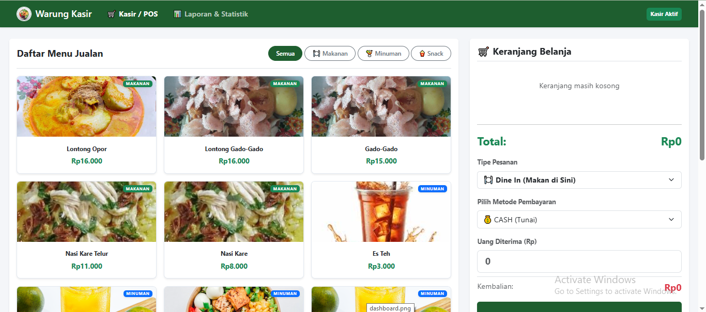
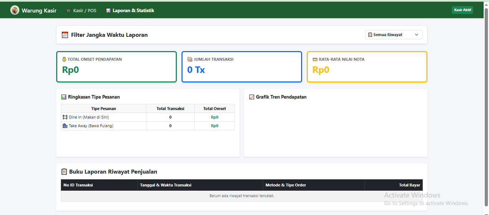

<div align="center">

# 🍽️ Kasir Kuliner

### Sistem Kasir Digital Berbasis Google Apps Script

Aplikasi kasir berbasis web yang membantu proses transaksi penjualan makanan dan minuman secara lebih cepat, praktis, dan terdokumentasi dengan baik menggunakan Google Apps Script dan Google Spreadsheet sebagai media penyimpanan data.

[](https://script.google.com/macros/s/AKfycbz2dMmjRqwwvJy87o-ld12bFYQEy4g1VLT1nqVlvL0/dev)
[]
[]
[]

</div>

---

# 📖 Tentang Project

**Kasir Kuliner** merupakan aplikasi kasir berbasis web yang dikembangkan menggunakan **Google Apps Script** dengan **Google Spreadsheet** sebagai database.

Aplikasi ini bertujuan membantu pemilik usaha kuliner dalam mengelola transaksi penjualan secara digital sehingga proses pelayanan menjadi lebih cepat, pencatatan lebih rapi, dan data penjualan tersimpan dengan aman.

---

# ✨ Fitur Utama

- 🍽️ Manajemen Data Menu
- 🛒 Transaksi Penjualan
- 💰 Perhitungan Total Belanja Otomatis
- 💵 Perhitungan Pembayaran & Kembalian
- 📊 Dashboard Penjualan
- 📈 Laporan Penjualan
- 📝 Penyimpanan Data Otomatis ke Google Spreadsheet
- 📱 Responsive Design

---

# 🌐 Live Demo

Silakan mencoba aplikasi melalui tautan berikut.

### 🔗 Demo Aplikasi

https://script.google.com/macros/s/AKfycbz2dMmjRqwwvJy87o-ld12bFYQEy4g1VLT1nqVlvL0/dev

> Aplikasi dapat langsung digunakan melalui browser tanpa memerlukan proses login.

---

# 📸 Screenshot

| Dashboard | Laporan Penjualan |
|-----------|-------------------|
|  |  |

---

# 🛠️ Tech Stack

| Teknologi | Digunakan Untuk |
|-----------|-----------------|
| Google Apps Script | Backend & Web App |
| Google Spreadsheet | Database |
| HTML | Struktur Halaman |
| CSS | Styling |
| JavaScript | Logika Aplikasi |

---

# 🚀 Cara Menggunakan

## 1. Clone Repository

```bash
git clone https://github.com/vickyagstn/myProject.git

cd myProject/Kasir-Kuliner
```

---

## 2. Buka Project Google Apps Script

Import project ke Google Apps Script atau buka project yang telah dibuat sebelumnya.

---

## 3. Hubungkan Spreadsheet

Pastikan project telah terhubung dengan Google Spreadsheet yang digunakan sebagai database.

---

## 4. Deploy

1. Klik **Deploy**
2. Pilih **New Deployment**
3. Pilih **Web App**
4. Atur hak akses
5. Klik **Deploy**

---

# 🗄️ Database

Project ini menggunakan **Google Spreadsheet** sebagai media penyimpanan data.

### Google Spreadsheet

https://docs.google.com/spreadsheets/d/14Whmc1WOsSs18AGrMygBn7GB6lI1EsQlrvNrqQFBhW0/edit?gid=0#gid=0

Semua data aplikasi disimpan secara otomatis ke dalam spreadsheet melalui Google Apps Script sehingga mudah dikelola dan tidak memerlukan database server tambahan.

---

# 📊 Data yang Dikelola

Aplikasi digunakan untuk mengelola data berikut.

- 🍽️ Data Menu
- 🛒 Data Transaksi
- 📈 Data Laporan Penjualan

---

# 📱 Alur Penggunaan

```text
Dashboard
     │
     ▼
Pilih Menu
     │
     ▼
Input Jumlah Pesanan
     │
     ▼
Hitung Total
     │
     ▼
Input Pembayaran
     │
     ▼
Hitung Kembalian
     │
     ▼
Simpan Transaksi
     │
     ▼
Data Masuk ke Spreadsheet
```

---

# 📁 Struktur Project

```text
Kasir-Kuliner/
│
├── images/
│   ├── dashboard.png
│   └── Laporan.png
│
├── Code.gs
├── Index.html
├── JavaScript.html
├── Style.html
├── appsscript.json
└── README.md
```

> Struktur file dapat disesuaikan dengan project yang digunakan.

---

# 🚀 Deployment

Project telah di-deploy menggunakan Google Apps Script.

| Platform | Link |
|----------|------|
| 🌐 Live Demo | https://script.google.com/macros/s/AKfycbz2dMmjRqwwvJy87o-ld12bFYQEy4g1VLT1nqVlvL0/dev |
| 📊 Google Spreadsheet | https://docs.google.com/spreadsheets/d/14Whmc1WOsSs18AGrMygBn7GB6lI1EsQlrvNrqQFBhW0/edit?gid=0#gid=0 |
| 💻 GitHub Repository | https://github.com/vickyagstn/myProject/tree/main/Kasir-Kuliner |

---

# 🎯 Manfaat Aplikasi

Dengan menggunakan **Kasir Kuliner**, proses transaksi menjadi lebih efektif karena:

- Mengurangi pencatatan manual.
- Mempercepat proses pelayanan pelanggan.
- Mengurangi kesalahan perhitungan.
- Menyimpan data penjualan secara otomatis.
- Mempermudah pembuatan laporan penjualan.

---

# 🗺️ Roadmap

- ✅ Dashboard
- ✅ Data Menu
- ✅ Transaksi Penjualan
- ✅ Laporan Penjualan
- ✅ Integrasi Google Spreadsheet
- ✅ Responsive Design
- ⬜ Export PDF
- ⬜ Export Excel
- ⬜ Grafik Penjualan

---

# 👨‍💻 Developer

**Vicky Agustine**

Mahasiswa Teknologi Rekayasa Perangkat Lunak

**GitHub**

https://github.com/vickyagstn

---

<div align="center">

### ⭐ Jangan lupa berikan Star apabila project ini bermanfaat.

Made with ❤️ by **Vicky Agustine**

</div>
