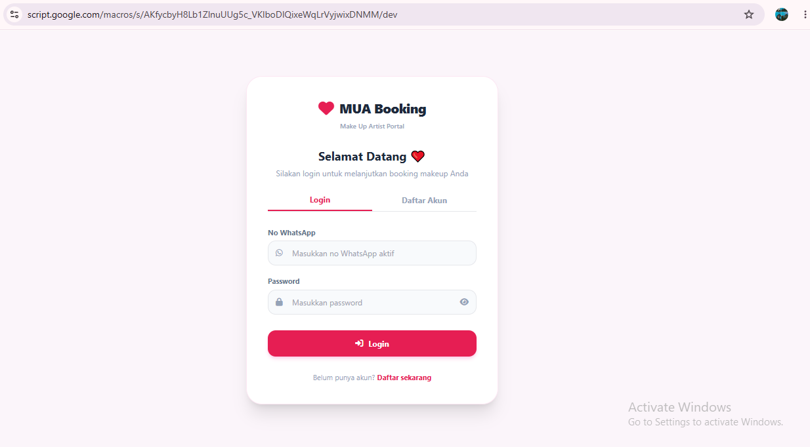
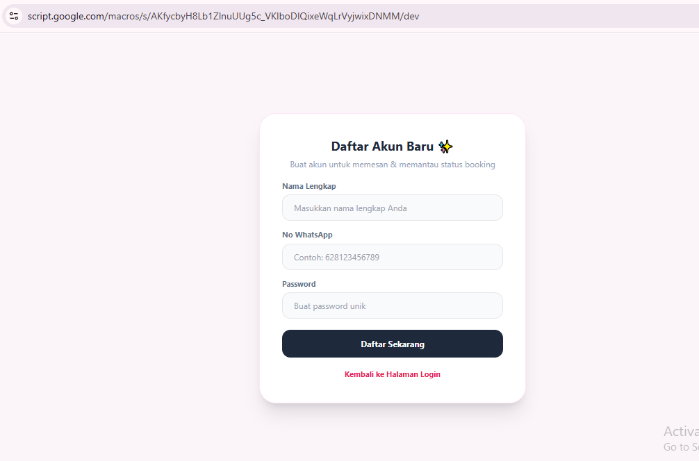
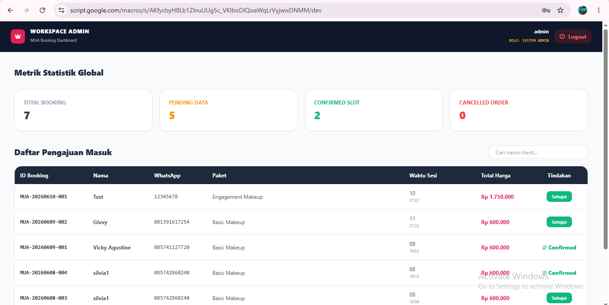
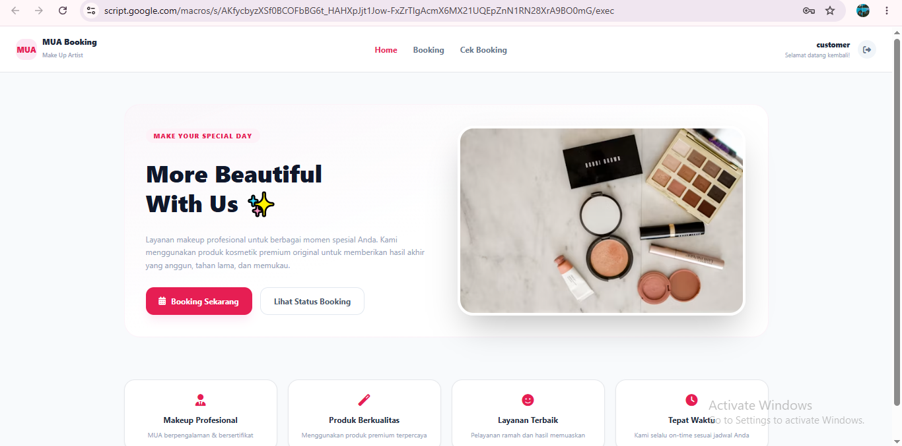
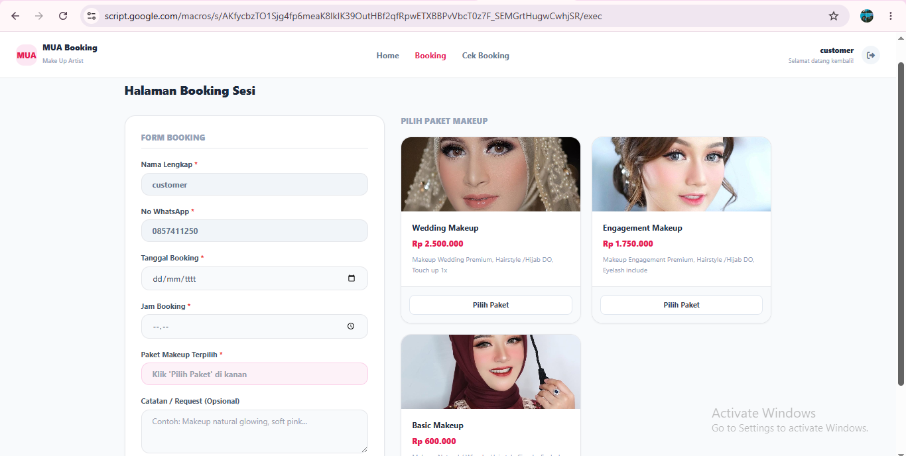
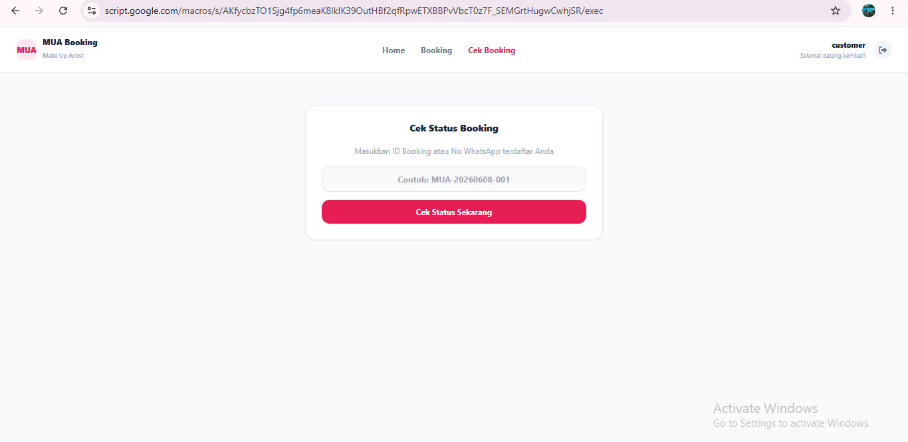

# 💄 MUA Booking Magang

<p align="center">
  
</p>

<h2 align="center">💄 Sistem Booking Make Up Artist Berbasis Web</h2>

<p align="center">
Aplikasi booking jasa <b>Make Up Artist (MUA)</b> yang membantu pelanggan melakukan pemesanan secara online serta memudahkan admin dalam mengelola data booking menggunakan <b>Google Spreadsheet</b> dan <b>Google Apps Script</b>.
</p>

---

# 📖 Tentang Project

**MUA Booking Magang** merupakan aplikasi booking jasa Make Up Artist berbasis web yang dikembangkan sebagai project magang.

Aplikasi ini memungkinkan pelanggan melakukan booking secara online dengan mudah, sedangkan admin dapat mengelola data booking, pelanggan, dan layanan melalui dashboard sederhana. Seluruh data disimpan pada **Google Spreadsheet** dan dihubungkan menggunakan **Google Apps Script** sebagai backend.

---

# 🎯 Tujuan

- Mempermudah proses booking jasa MUA.
- Mengurangi pencatatan manual.
- Menyimpan data booking secara digital.
- Mempermudah admin mengelola data pelanggan.
- Mempermudah pengelolaan jadwal booking.

---

# ✨ Fitur

## 👤 Customer

### 🔐 Autentikasi
- Login Customer
- Registrasi Akun Baru
- Logout

### 🏠 Home
- Melihat informasi MUA
- Melihat daftar paket makeup
- Navigasi menuju halaman Booking
- Navigasi menuju halaman Cek Booking

### 💄 Booking MUA
- Mengisi Form Booking
- Memilih Paket Makeup
- Memilih Tanggal Booking
- Memilih Jam Booking
- Menambahkan Catatan
- Mengirim Booking

### 📋 Cek Booking
- Melihat Status Booking
- Melihat Detail Booking
- Melihat Paket Makeup
- Melihat Jadwal Booking

---

## 👨‍💼 Admin

### Dashboard
- Melihat seluruh data booking
- Mengelola data booking
- Mengubah status booking
- Mengelola data customer
- Mengelola paket makeup
- Rekap data booking

---

# 🖼️ Tampilan Aplikasi

## 🔐 Login

<p align="center">

</p>

---

## 📝 Daftar Akun Baru

<p align="center">

</p>

---

## 👨‍💼 Dashboard Admin

<p align="center">

</p>

---

## 👤 Dashboard Customer

<p align="center">

</p>

---

## 💄 Booking MUA

<p align="center">

</p>

---

## 📋 Cek Booking

<p align="center">

</p>

---

# 🔑 Demo Login

Gunakan akun berikut untuk mencoba aplikasi.

<p align="center">

</p>

## 👨‍💼 Admin

| Username | Password |
|----------|----------|
| **admin** | **admin123** |

### Hak Akses
- Dashboard Admin
- Kelola Booking
- Kelola Customer
- Kelola Paket Makeup
- Logout

---

## 👤 Customer

| Nomor WhatsApp | Password |
|----------------|----------|
| **085741150** | **customer12** |

### Hak Akses
- Home
- Booking MUA
- Cek Booking
- Logout

> **Catatan:** Akun demo hanya digunakan untuk keperluan demonstrasi aplikasi.

---

# 🌐 Demo & Project

## 🚀 Demo Aplikasi

Akses aplikasi melalui Google Apps Script:

**🔗 Demo Web**

https://script.google.com/macros/s/AKfycbzM3lFxjWjnbO5DpK_L6u4QL72I_mPaQBpR9DCxRI8SeSXQM_PxCEaWxF3RQ3v59GZj/exec

---

## 📊 Database Google Spreadsheet

Seluruh data booking disimpan pada Google Spreadsheet.

**🔗 Spreadsheet**

https://docs.google.com/spreadsheets/d/1hXezBFIxhE7BBg6iF2yRvaV7mWFTALfAtqDdbWqNPv4/edit?usp=sharing

---

## 💻 Source Code

Repository GitHub

https://github.com/vickyagstn/myProject/tree/main/MuaBooking-Magang

---

# 🛠️ Teknologi

| Teknologi | Kegunaan |
|-----------|----------|
| HTML | Struktur Halaman |
| CSS | Tampilan |
| JavaScript | Interaksi Aplikasi |
| Google Spreadsheet | Database |
| Google Apps Script | Backend / REST API |

---

# 🌐 API

Backend aplikasi menggunakan **Google Apps Script** yang terhubung langsung dengan **Google Spreadsheet**.

### Endpoint

```text
https://script.google.com/macros/s/AKfycbzM3lFxjWjnbO5DpK_L6u4QL72I_mPaQBpR9DCxRI8SeSXQM_PxCEaWxF3RQ3v59GZj/exec
```

### Fungsi API

- Menyimpan Data Booking
- Mengambil Data Booking
- Mengubah Status Booking
- Mengelola Data Customer
- Mengelola Paket Makeup

---

# 📂 Struktur Project

```text
MuaBooking-Magang
│
├── css/
├── js/
├── images/
│   ├── cover.png
│   ├── login.png
│   ├── register.png
│   ├── admin-dashboard.png
│   ├── customer-dashboard.png
│   ├── booking.png
│   └── cek-booking.png
│
├── index.html
└── README.md
```

---

# 🚀 Cara Menggunakan

1. Buka Demo Aplikasi.
2. Login menggunakan akun demo.
3. Pilih paket makeup.
4. Tentukan tanggal dan jam booking.
5. Kirim data booking.
6. Admin dapat melihat seluruh data booking melalui dashboard.

---

# 📱 Responsive

Aplikasi dapat digunakan pada berbagai perangkat.

- 💻 Desktop
- 📱 Tablet
- 📱 Mobile

---

# ⭐ Kelebihan Aplikasi

- Tampilan sederhana dan mudah digunakan.
- Responsive pada berbagai perangkat.
- Booking dilakukan secara online.
- Data tersimpan otomatis di Google Spreadsheet.
- Backend menggunakan Google Apps Script.
- Mudah dikembangkan sesuai kebutuhan.
- Mempermudah admin mengelola data booking.

---

# 👨‍💻 Developer

**Vicky Agustine**

Mahasiswa Teknologi Rekayasa Perangkat Lunak

Project Magang

---

# 📄 Lisensi

Project ini dibuat untuk keperluan pembelajaran dan project magang.

---

<p align="center">
⭐ Jangan lupa berikan <b>Star</b> jika project ini bermanfaat.
</p>

<p align="center">
Made with ❤️ by <b>Vicky Agustine</b>
</p>
