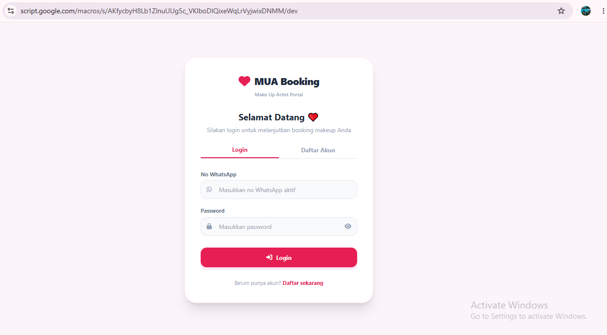
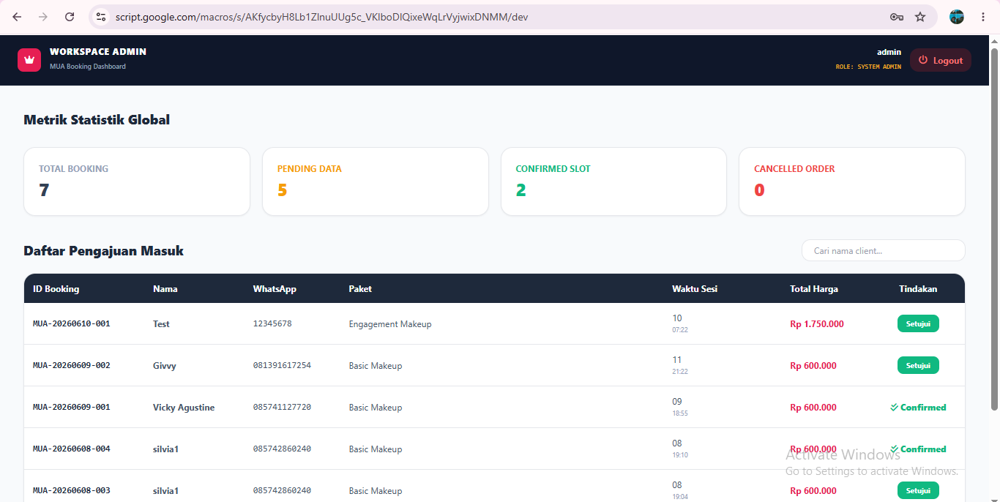
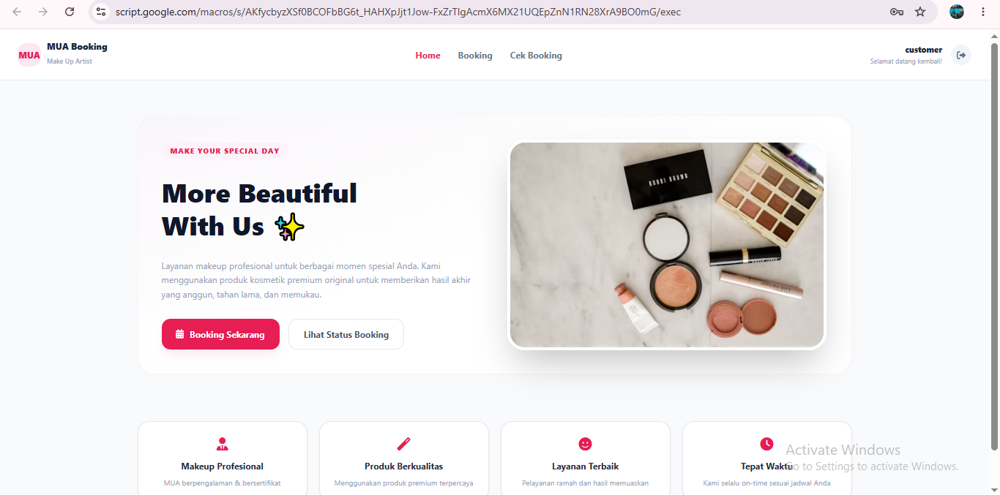
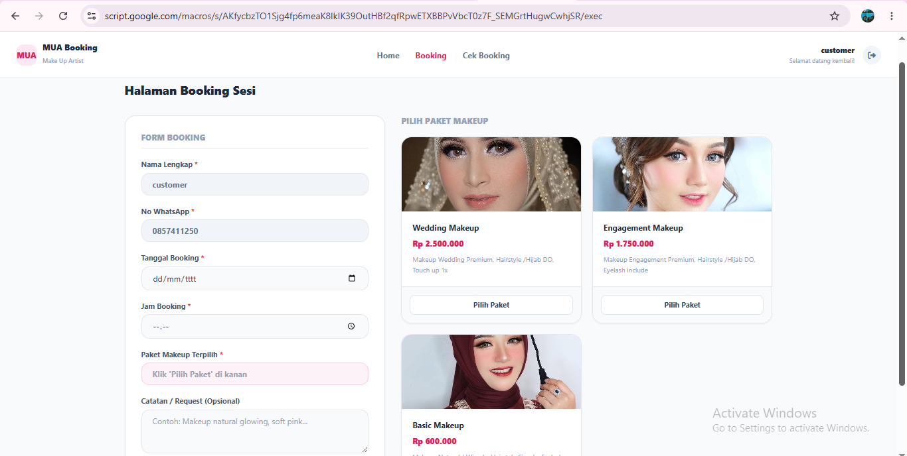
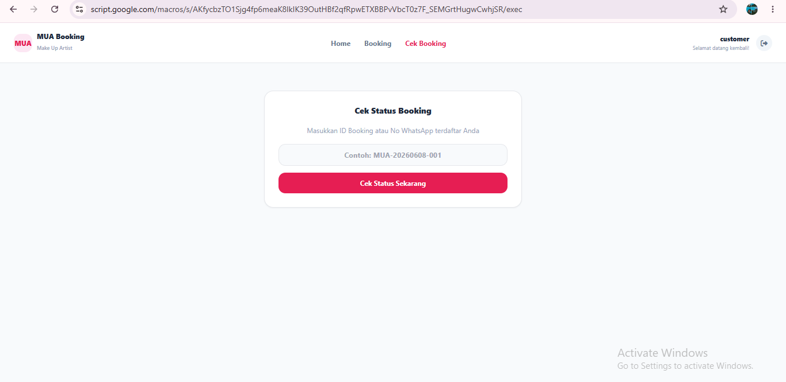

<div align="center">

# 💄 MuaBooking Magang

### Sistem Booking Makeup Artist Berbasis Google Apps Script

Aplikasi booking Makeup Artist (MUA) berbasis web yang dikembangkan menggunakan **Google Apps Script** dan **Google Spreadsheet** untuk memudahkan pelanggan melakukan reservasi layanan makeup serta membantu admin mengelola jadwal dan data booking secara digital.

[](https://script.google.com/macros/s/AKfycbyH8Lb1ZlnuUUg5c_VKlboDIQixeWqLrVyjwixDNMM/dev)


</div>

---

# 📖 Tentang Project

**MuaBooking Magang** merupakan aplikasi booking layanan Makeup Artist berbasis web yang dikembangkan untuk membantu proses reservasi pelanggan secara digital.

Melalui aplikasi ini, pelanggan dapat melakukan booking makeup, melihat status booking, serta memantau informasi reservasi. Admin dapat mengelola data pelanggan, jadwal booking, serta memonitor seluruh proses pemesanan dalam satu dashboard.

Project ini dikembangkan menggunakan **Google Apps Script** dengan **Google Spreadsheet** sebagai media penyimpanan data sehingga mudah dikelola tanpa memerlukan database server terpisah.

---

# ✨ Fitur Utama

### 👩 Customer

- 🔐 Login Customer
- 💄 Booking Makeup
- 📅 Memilih Jadwal Booking
- 📋 Melihat Status Booking
- 👤 Dashboard Customer
- 📄 Riwayat Booking

### 👨‍💼 Admin

- 🔐 Login Admin
- 📊 Dashboard Admin
- 📅 Kelola Booking
- 👥 Kelola Data Customer
- ✅ Konfirmasi Booking
- 📈 Monitoring Data Booking

---

# 🌐 Live Demo

Silakan mencoba aplikasi melalui tautan berikut.

## 🔗 Demo Aplikasi

https://script.google.com/macros/s/AKfycbyH8Lb1ZlnuUUg5c_VKlboDIQixeWqLrVyjwixDNMM/dev

---

## 👤 Akun Demo

| Role | Username / Nomor HP | Password |
|------|----------------------|----------|
| 👨‍💼 Admin | `admin` | `admin123` |
| 👩 Customer | `0857411250` | `customer12` |

---

# 📸 Screenshot

| Login | Dashboard Admin |
|--------|-----------------|
|  |  |

<br>

| Dashboard Customer | Booking Makeup |
|--------------------|----------------|
|  |  |

<br>

| Cek Status Booking |
|--------------------|
|  |

---

# 🛠️ Tech Stack

| Teknologi | Digunakan Untuk |
|-----------|-----------------|
| Google Apps Script | Backend & Web Application |
| Google Spreadsheet | Database |
| HTML5 | Struktur Halaman |
| CSS3 | Styling |
| JavaScript | Logika Aplikasi |

---

# 🚀 Cara Menjalankan

## 1. Clone Repository

```bash
git clone https://github.com/vickyagstn/myProject.git

cd myProject/MuaBooking-Magang
```

---

## 2. Import Project

Import seluruh project ke **Google Apps Script**.

---

## 3. Hubungkan Spreadsheet

Hubungkan project dengan Google Spreadsheet yang digunakan sebagai database.

---

## 4. Deploy

1. Klik **Deploy**
2. Pilih **New Deployment**
3. Pilih **Web App**
4. Atur hak akses
5. Klik **Deploy**

---

# 🗄️ Database

Project menggunakan **Google Spreadsheet** sebagai media penyimpanan data.

## Google Spreadsheet

https://docs.google.com/spreadsheets/d/1hXezBFIxhE7BBg6iF2yRvaV7mWFTALfAtqDdbWqNPv4/edit?gid=0#gid=0

Data akan tersimpan secara otomatis melalui Google Apps Script sehingga mudah dikelola dan dipantau.

---

# 📋 Data yang Dikelola

- 👤 Data Customer
- 💄 Data Booking
- 📅 Jadwal Booking
- 📊 Status Booking

---

# 👥 Hak Akses

## 👨‍💼 Admin

Admin memiliki akses penuh terhadap seluruh data aplikasi.

### Menu

- Dashboard
- Data Booking
- Data Customer
- Konfirmasi Booking
- Monitoring Booking

---

## 👩 Customer

Customer dapat mengakses fitur yang berkaitan dengan pemesanan layanan.

### Menu

- Dashboard
- Booking Makeup
- Cek Status Booking
- Riwayat Booking
- Profil

---

# 📱 Alur Penggunaan

```text
Customer Login
      │
      ▼
Pilih Layanan Makeup
      │
      ▼
Pilih Tanggal Booking
      │
      ▼
Kirim Booking
      │
      ▼
Admin Menerima Booking
      │
      ▼
Konfirmasi Booking
      │
      ▼
Customer Melihat Status Booking
```

---

# 📁 Struktur Project

```text
MuaBooking-Magang/
│
├── images/
│   ├── login.png
│   ├── admin-dashboard.png
│   ├── customer-dashboard.png
│   ├── booking.png
│   └── cek-booking.png
│
├── Code.gs
├── Index.html
├── JavaScript.html
├── Style.html
├── appsscript.json
└── README.md
```

> Struktur file dapat disesuaikan dengan project yang digunakan.

---

# 🚀 Deployment

Project telah di-deploy menggunakan **Google Apps Script Web App**.

| Platform | Link |
|----------|------|
| 🌐 Live Demo | https://script.google.com/macros/s/AKfycbyH8Lb1ZlnuUUg5c_VKlboDIQixeWqLrVyjwixDNMM/dev |
| 📊 Google Spreadsheet | https://docs.google.com/spreadsheets/d/1hXezBFIxhE7BBg6iF2yRvaV7mWFTALfAtqDdbWqNPv4/edit?gid=0#gid=0 |
| 💻 GitHub Repository | https://github.com/vickyagstn/myProject/tree/main/MuaBooking-Magang |

---

# 🎯 Manfaat Aplikasi

Dengan menggunakan **MuaBooking Magang**, proses pemesanan layanan makeup menjadi lebih praktis karena:

- Mempermudah pelanggan melakukan booking secara online.
- Membantu admin mengelola jadwal booking.
- Mengurangi pencatatan manual.
- Menyimpan data booking secara digital.
- Memudahkan monitoring seluruh reservasi.

---

# 🗺️ Roadmap

- ✅ Login Admin
- ✅ Login Customer
- ✅ Dashboard Admin
- ✅ Dashboard Customer
- ✅ Booking Makeup
- ✅ Cek Status Booking
- ✅ Monitoring Booking
- ✅ Google Spreadsheet Integration
- ✅ Responsive Design
- ⬜ Notifikasi WhatsApp
- ⬜ Export PDF
- ⬜ Export Excel

---

# 👨‍💻 Developer

**Vicky Agustine**

Mahasiswa Teknologi Rekayasa Perangkat Lunak

**GitHub**

https://github.com/vickyagstn

---

<div align="center">

### ⭐ Jangan lupa berikan Star apabila project ini bermanfaat.

Made with ❤️ by **Vicky Agustine**

</div>
