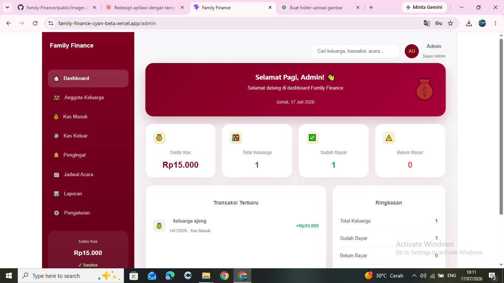

<div align="center">

# 💰 Family Finance

### Sistem Manajemen Keuangan Keluarga Berbasis Web

Aplikasi **Family Finance** merupakan sistem manajemen keuangan keluarga yang dirancang untuk membantu pengguna dalam mengelola pemasukan, pengeluaran, serta memantau kondisi keuangan keluarga secara lebih mudah, rapi, dan terstruktur.

[](https://family-finance-cyan-beta.vercel.app/)


</div>

---

# 📖 Tentang Project

**Family Finance** adalah aplikasi berbasis web yang membantu keluarga dalam mengelola keuangan sehari-hari secara digital.

Melalui aplikasi ini, pengguna dapat mencatat pemasukan, pengeluaran, melihat ringkasan keuangan, serta memantau kondisi finansial keluarga dalam satu dashboard yang mudah digunakan.

Project ini dikembangkan menggunakan **React**, **Vite**, **Tailwind CSS**, dan **Supabase** sebagai backend dan database.

---

# ✨ Fitur Utama

## 👨‍💼 Admin

- 📊 Dashboard Admin
- 👨‍👩‍👧 Kelola Data Anggota
- 💰 Kelola Pemasukan
- 💸 Kelola Pengeluaran
- 📈 Monitoring Keuangan
- 📋 Laporan Keuangan

---

## 👨‍👩‍👧 Anggota

- 📊 Dashboard Anggota
- 💰 Melihat Data Pemasukan
- 💸 Melihat Data Pengeluaran
- 📈 Ringkasan Keuangan
- 👤 Profil Pengguna

---

# 🌐 Live Demo

Silakan mencoba aplikasi melalui tautan berikut.

## 🔗 Demo Aplikasi

https://family-finance-cyan-beta.vercel.app/

---

# 👤 Akun Demo

| Role | Email | Password |
|------|-------|----------|
| 👨‍💼 Admin | `admin@familyfinance.com` | `admin123` |
| 👨‍👩‍👧 Anggota | `ajeng@familyfinance.com` | `ajeng123` |

---

# 📸 Screenshot

| Login | Dashboard Admin |
|--------|-----------------|
|  |  |

<br>

| Dashboard Anggota |
|-------------------|
|  |

---

# 🛠️ Tech Stack

| Teknologi | Digunakan Untuk |
|-----------|-----------------|
| React JS | Frontend |
| Vite | Build Tool |
| Tailwind CSS | Styling |
| Supabase | Backend & Database |
| JavaScript | Programming Language |

---

# 🚀 Cara Menjalankan

## 1. Clone Repository

```bash
git clone https://github.com/vickyagstn/myProject.git

cd myProject/family-finance
```

---

## 2. Install Dependency

```bash
npm install
```

---

## 3. Jalankan Project

```bash
npm run dev
```

Project akan berjalan di

```
http://localhost:5173
```

---

# 🗄️ Database

Project menggunakan **Supabase** sebagai backend dan database.

## Supabase Dashboard

https://supabase.com/dashboard/project/bjdgyjsqfvsiomuyqoyu

Supabase digunakan untuk:

- Authentication
- Database PostgreSQL
- Penyimpanan Data
- API

---

# 📂 Data yang Dikelola

- 👨‍👩‍👧 Data Anggota
- 💰 Data Pemasukan
- 💸 Data Pengeluaran
- 📊 Ringkasan Keuangan

---

# 👥 Hak Akses

## 👨‍💼 Admin

Admin memiliki akses penuh terhadap seluruh data.

Menu yang tersedia:

- Dashboard
- Data Anggota
- Pemasukan
- Pengeluaran
- Laporan

---

## 👨‍👩‍👧 Anggota

Anggota dapat mengakses data keuangannya sendiri.

Menu yang tersedia:

- Dashboard
- Pemasukan
- Pengeluaran
- Ringkasan Keuangan
- Profil

---

# 📱 Alur Penggunaan

```text
Login
   │
   ▼
Dashboard
   │
   ▼
Input Pemasukan
   │
   ▼
Input Pengeluaran
   │
   ▼
Data Tersimpan
   │
   ▼
Laporan Keuangan
```

---

# 📁 Struktur Project

```text
family-finance/
│
├── image/
│   ├── login.png
│   ├── dashboard-admin.png
│   └── dashboard-anggota.png
│
├── src/
├── public/
├── package.json
├── vite.config.js
└── README.md
```

---

# 🚀 Deployment

| Platform | Link |
|----------|------|
| 🌐 Live Demo | https://family-finance-cyan-beta.vercel.app/ |
| 🗄️ Supabase | https://supabase.com/dashboard/project/bjdgyjsqfvsiomuyqoyu |
| 💻 GitHub Repository | https://github.com/vickyagstn/myProject/tree/main/family-finance |

---

# 🎯 Manfaat Aplikasi

Dengan menggunakan **Family Finance**, pengguna dapat:

- Mengelola keuangan keluarga secara digital.
- Memantau pemasukan dan pengeluaran.
- Mengurangi pencatatan manual.
- Mengetahui kondisi keuangan secara real-time.
- Membantu pengambilan keputusan keuangan keluarga.

---

# 🗺️ Roadmap

- ✅ Login
- ✅ Dashboard Admin
- ✅ Dashboard Anggota
- ✅ Pencatatan Pemasukan
- ✅ Pencatatan Pengeluaran
- ✅ Ringkasan Keuangan
- ✅ Supabase Integration
- ✅ Responsive Design
- ⬜ Export PDF
- ⬜ Export Excel
- ⬜ Grafik Keuangan

---

# 👨‍💻 Developer

**Vicky Agustine**

Mahasiswa Teknologi Rekayasa Perangkat Lunak

GitHub

https://github.com/vickyagstn

---

<div align="center">

### ⭐ Jangan lupa berikan Star apabila project ini bermanfaat.

Made with ❤️ by **Vicky Agustine**

</div>
