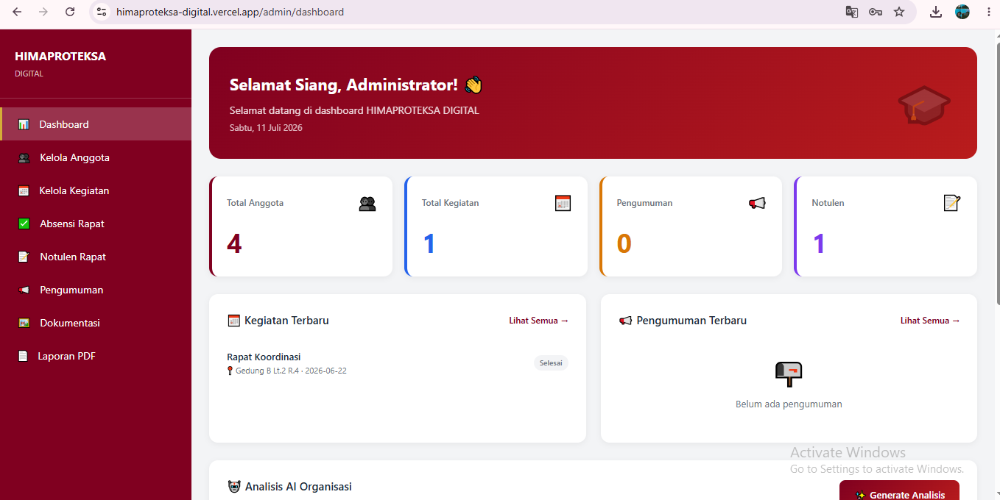
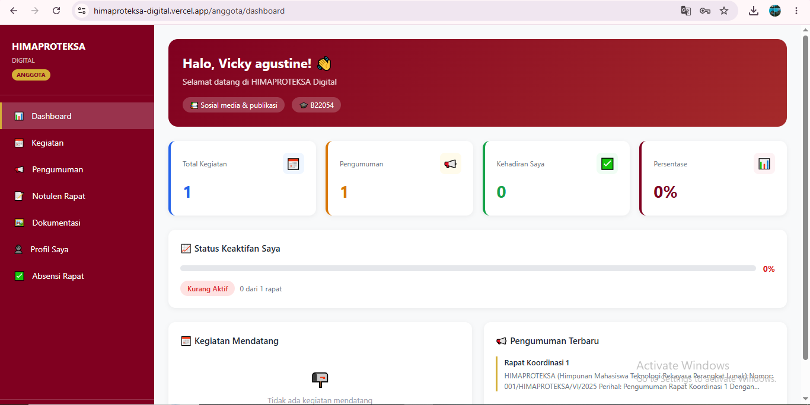
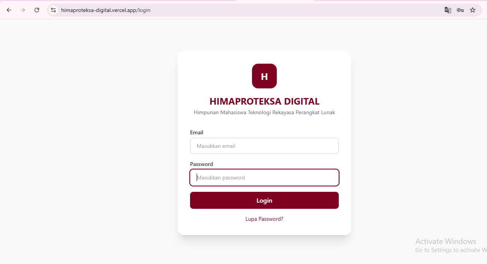

# HIMAPROTEKSA DIGITAL

<p align="center">
  <b>Sistem Informasi Himpunan Mahasiswa Teknologi Rekayasa Perangkat Lunak</b>
</p>

<p align="center">
Website untuk membantu pengelolaan organisasi HIMAPROTEKSA secara digital, mulai dari data anggota, kegiatan, absensi, notulen rapat, pengumuman, hingga dokumentasi organisasi.
</p>

---

## 📖 Tentang Aplikasi

HIMAPROTEKSA DIGITAL merupakan aplikasi berbasis web yang dikembangkan untuk membantu pengurus Himpunan Mahasiswa Teknologi Rekayasa Perangkat Lunak dalam mengelola administrasi organisasi secara lebih efektif dan efisien.

Dengan adanya aplikasi ini, proses pencatatan anggota, pengelolaan kegiatan, absensi, dokumentasi, serta penyampaian informasi kepada anggota dapat dilakukan dalam satu sistem yang terintegrasi.

---

# ✨ Fitur Utama

## 👨‍💼 Admin

- Login Admin
- Dashboard Admin
- Kelola Data Anggota
- Kelola Kegiatan
- Kelola Absensi
- Kelola Notulen Rapat
- Kelola Pengumuman
- Kelola Dokumentasi
- Monitoring Keaktifan Anggota
- Logout

---

## 👨‍🎓 Anggota

- Login Anggota
- Dashboard Anggota
- Melihat Profil
- Melihat Kegiatan
- Melakukan Absensi
- Melihat Notulen
- Melihat Pengumuman
- Melihat Dokumentasi
- Logout

---

# 🤖 Fitur AI

Aplikasi menggunakan **OpenRouter API** sebagai AI Assistant untuk membantu:

- Membuat notulen rapat secara otomatis.
- Membuat ringkasan hasil rapat.
- Membantu menyusun pengumuman.
- Membantu penulisan administrasi organisasi.

---

# 🛠️ Teknologi yang Digunakan

| Teknologi | Fungsi |
|-----------|--------|
| React JS (Vite) | Frontend |
| Tailwind CSS | User Interface |
| React Router DOM | Routing |
| Firebase Authentication | Login |
| Firebase Firestore | Database |
| Firebase Storage | Penyimpanan File |
| OpenRouter API | AI Assistant |
| GitHub | Version Control |
| Vercel | Deployment |

---

# 📂 Struktur Project

```text
himaproteksa-digital
│
├── public
│   └── images
│       ├── admin-dashboard.png
│       ├── user-dashboard.png
│       └── admin-user-page.png
│
├── src
│   ├── components
│   ├── pages
│   ├── hooks
│   ├── lib
│   ├── services
│   └── assets
│
├── package.json
├── vite.config.js
└── README.md
```

---

# 📸 Tampilan Aplikasi

## Dashboard

| Admin | User |
|-------|------|
|  |  |

### Halaman Admin & User



---

# 🚀 Instalasi

Clone repository

```bash
git clone https://github.com/vickyagstn/myProject.git
```

Masuk ke folder project

```bash
cd himaproteksa-digital
```

Install dependency

```bash
npm install
```

Jalankan aplikasi

```bash
npm run dev
```

Build aplikasi

```bash
npm run build
```

---

# 🔥 Konfigurasi Firebase

Buat file `.env`

```env
VITE_FIREBASE_API_KEY=YOUR_API_KEY
VITE_FIREBASE_AUTH_DOMAIN=YOUR_AUTH_DOMAIN
VITE_FIREBASE_PROJECT_ID=YOUR_PROJECT_ID
VITE_FIREBASE_STORAGE_BUCKET=YOUR_STORAGE_BUCKET
VITE_FIREBASE_MESSAGING_SENDER_ID=YOUR_MESSAGING_SENDER_ID
VITE_FIREBASE_APP_ID=YOUR_APP_ID
```

---

# 🤖 Konfigurasi OpenRouter

Tambahkan API Key OpenRouter pada file `.env`

```env
VITE_OPENROUTER_API_KEY=YOUR_OPENROUTER_API_KEY
```

---

# 🎯 Tujuan Pengembangan

- Mempermudah administrasi organisasi.
- Memudahkan pengelolaan data anggota.
- Menyediakan informasi organisasi secara terpusat.
- Mendukung digitalisasi kegiatan HIMAPROTEKSA.
- Membantu pengurus dalam penyusunan notulen menggunakan AI.

---

# 🌐 Deployment

Aplikasi dapat di-deploy menggunakan:

- Vercel
- Firebase Hosting

---

# 👩‍💻 Developer

**Vicky Agustine**

Program Studi Teknologi Rekayasa Perangkat Lunak

Politeknik Indonusa Surakarta

---

# 📄 Lisensi

Project ini dikembangkan untuk keperluan akademik dan pengembangan organisasi **HIMAPROTEKSA**.

Seluruh kode dapat dikembangkan kembali sesuai kebutuhan dengan tetap mencantumkan kredit kepada pengembang.
