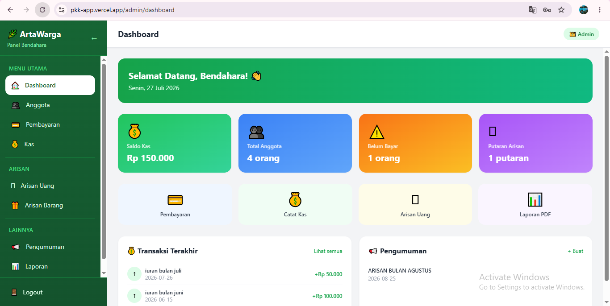
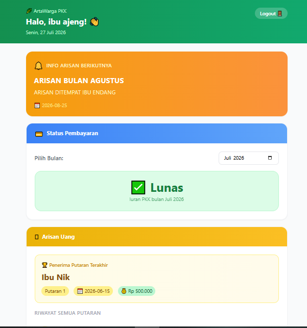

<div align="center">

# 🌸 PKK-App

### Sistem Informasi Manajemen PKK Digital

Aplikasi berbasis web yang dirancang untuk membantu pengurus PKK dalam mengelola administrasi organisasi secara digital, mulai dari data anggota, kas, arisan, kegiatan, hingga pengumuman dalam satu sistem yang mudah digunakan.

[](https://pkk-app.vercel.app/)
[](https://react.dev/)
[](https://firebase.google.com/)
[](https://vercel.com/)

</div>

---

# 📌 Tentang PKK-App

**PKK-App** merupakan aplikasi berbasis web yang dikembangkan untuk membantu pengurus PKK dalam mengelola administrasi secara digital.

Melalui aplikasi ini, seluruh data anggota, kas, arisan, jadwal kegiatan, dan pengumuman dapat dikelola dengan lebih mudah, cepat, dan terstruktur sehingga mengurangi pencatatan manual serta mempermudah penyampaian informasi kepada seluruh anggota.

---

# ✨ Fitur Utama

- 🔐 Login Multi Role (Admin & Anggota)
- 👥 Manajemen Data Anggota
- 💰 Manajemen Kas PKK
- 🎁 Manajemen Arisan
- 📅 Jadwal Kegiatan
- 📢 Pengumuman
- 📄 Riwayat Pembayaran Kas
- 📊 Dashboard Informasi
- 🔍 Pencarian Data
- 📱 Responsive Design

---

# 🌐 Live Demo

Silakan mencoba aplikasi melalui tautan berikut.

## https://pkk-app.vercel.app/

### Akun Demo

| Role | Email | Password |
|------|-------|----------|
| 👨‍💼 Admin | `admin@pkk.com` | `admin123` |
| 👩 Anggota | `ajeng@pkk.com` | `ajeng123` |

> Akun di atas hanya digunakan untuk keperluan demonstrasi aplikasi.

---

# 📸 Screenshot

| Login | Dashboard Admin |
|--------|-----------------|
|  |  |

<br>

| Data Anggota |
|--------------|
|  |

---

# 🛠️ Tech Stack

| Teknologi | Kegunaan |
|-----------|----------|
| React | Frontend |
| Vite | Build Tool |
| Firebase Authentication | Autentikasi |
| Cloud Firestore | Database |
| Tailwind CSS | User Interface |
| React Router DOM | Routing |
| Vercel | Deployment |

---

# 🚀 Cara Menjalankan Project

## 1. Clone Repository

```bash
git clone https://github.com/vickyagstn/myProject.git

cd myProject/pkk-app
```

---

## 2. Install Dependencies

```bash
npm install
```

---

## 3. Jalankan Project

```bash
npm run dev
```

Buka browser

```
http://localhost:5173
```

---

# 🔥 Firebase

Project ini menggunakan **Firebase** sebagai backend untuk autentikasi dan penyimpanan data.

## Firebase Project

**Project Name**

```
arisan-pkk
```

**Firebase Console**

https://console.firebase.google.com/project/arisan-pkk/overview

### Layanan Firebase

- 🔐 Firebase Authentication
- 🗄️ Cloud Firestore
- ☁️ Firebase Storage

---

# 🔑 Environment Variables

Buat file `.env`

```env
VITE_FIREBASE_API_KEY=

VITE_FIREBASE_AUTH_DOMAIN=

VITE_FIREBASE_PROJECT_ID=

VITE_FIREBASE_STORAGE_BUCKET=

VITE_FIREBASE_MESSAGING_SENDER_ID=

VITE_FIREBASE_APP_ID=
```

> Jangan mengunggah file `.env` ke GitHub.

---

# 👥 Hak Akses

## 👨‍💼 Admin

Admin memiliki akses penuh terhadap seluruh fitur aplikasi.

### Menu

- 📊 Dashboard
- 👥 Data Anggota
- 💰 Kas PKK
- 🎁 Arisan
- 📅 Jadwal Kegiatan
- 📢 Pengumuman
- 📄 Laporan
- 👤 Profil

---

## 👩 Anggota

Anggota dapat mengakses informasi yang berkaitan dengan keanggotaannya.

### Menu

- 🏠 Dashboard
- 👤 Profil
- 💰 Informasi Kas
- 🎁 Status Arisan
- 📅 Jadwal Kegiatan
- 📢 Pengumuman
- 📄 Riwayat Pembayaran

---

# 📱 Alur Penggunaan

```text
Login
   │
   ▼
Dashboard
   │
   ├── Data Anggota
   ├── Kas PKK
   ├── Arisan
   ├── Jadwal Kegiatan
   ├── Pengumuman
   └── Profil
```

---

# 📁 Struktur Project

```text
pkk-app/
│
├── public/
│
├── images/
│   ├── login.png
│   ├── dashboard-admin.png
│   └── anggota.png
│
├── src/
│   ├── assets/
│   ├── components/
│   ├── pages/
│   ├── context/
│   ├── services/
│   ├── hooks/
│   ├── routes/
│   ├── utils/
│   ├── firebase/
│   ├── App.jsx
│   └── main.jsx
│
├── package.json
├── vite.config.js
└── README.md
```

---

# 🚀 Deployment

Project telah di-deploy menggunakan layanan berikut.

| Platform | Link |
|----------|------|
| 🌐 Live Demo | https://pkk-app.vercel.app/ |
| 🔥 Firebase | https://console.firebase.google.com/project/arisan-pkk/overview |
| 💻 GitHub | https://github.com/vickyagstn/myProject/tree/main/pkk-app |

---

# 🗺️ Roadmap

- ✅ Login Multi Role
- ✅ Dashboard
- ✅ Manajemen Data Anggota
- ✅ Manajemen Kas
- ✅ Manajemen Arisan
- ✅ Jadwal Kegiatan
- ✅ Pengumuman
- ✅ Responsive Design
- ⬜ Export PDF
- ⬜ Export Excel
- ⬜ Notifikasi WhatsApp

---

# 👨‍💻 Developer

**Vicky Agustine**

Mahasiswa Teknologi Rekayasa Perangkat Lunak

GitHub

https://github.com/vickyagstn

---

<div align="center">

### ⭐ Jangan lupa berikan Star apabila project ini bermanfaat.

Made with ❤️ by **Vicky Agustine**

</div>
