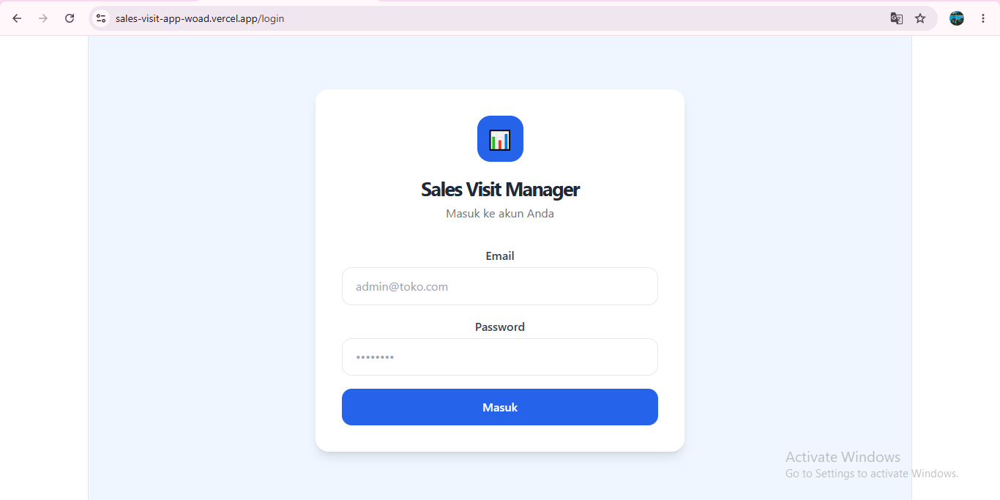
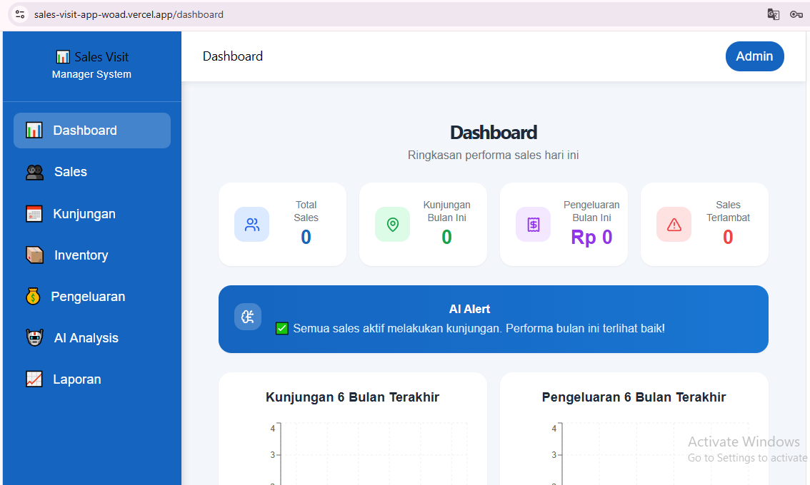
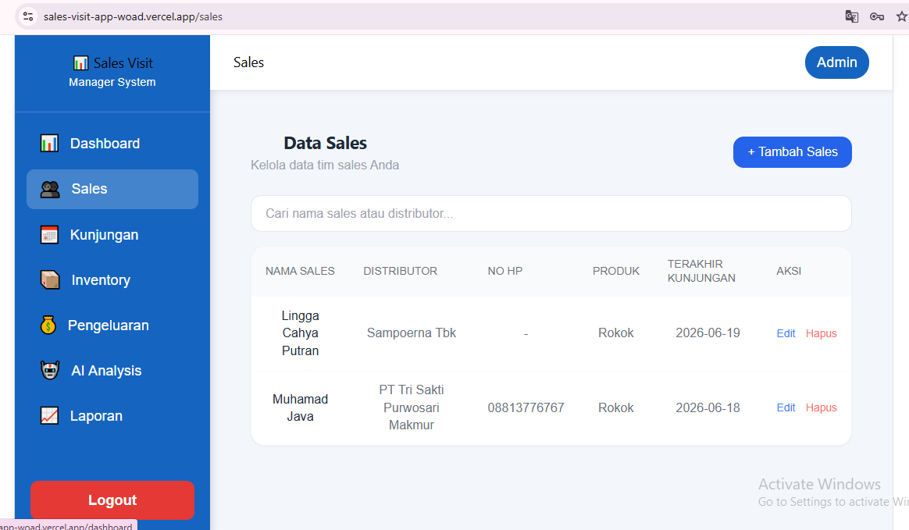
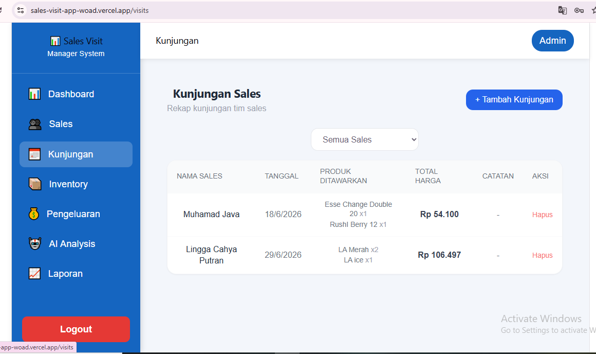
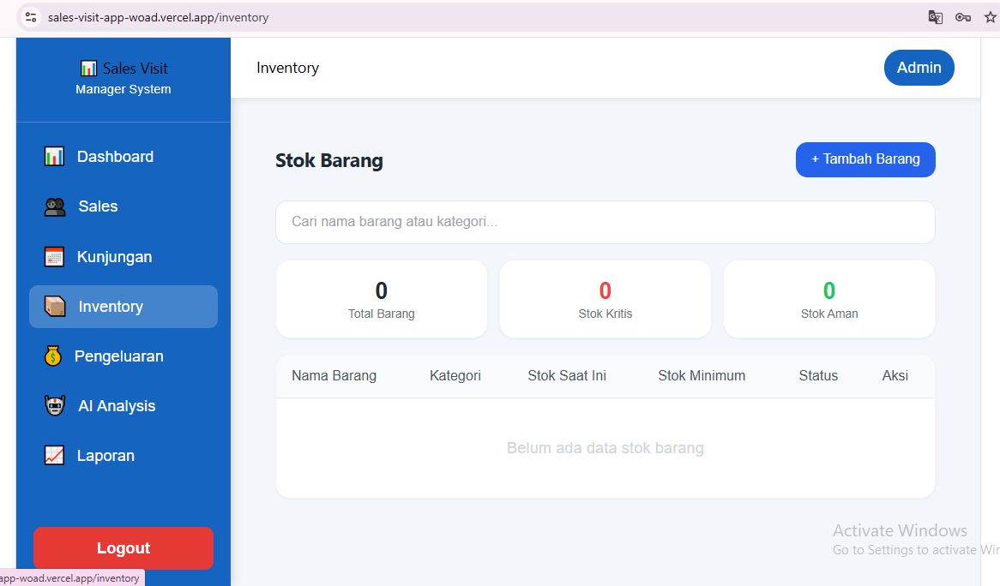
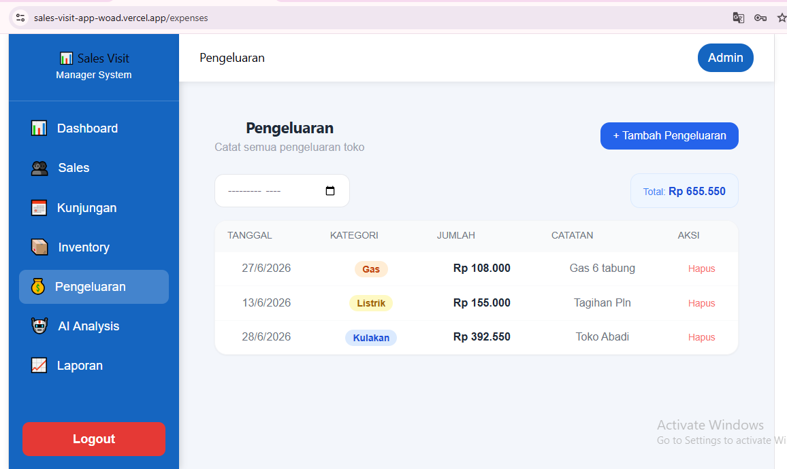
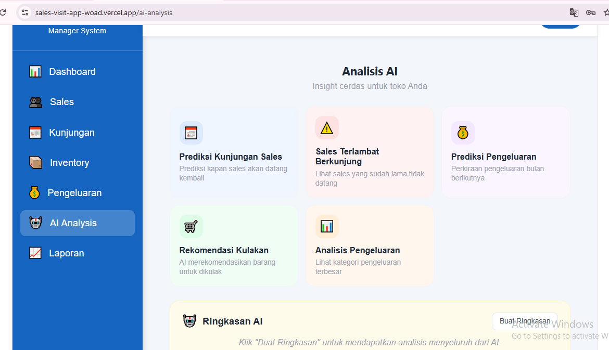
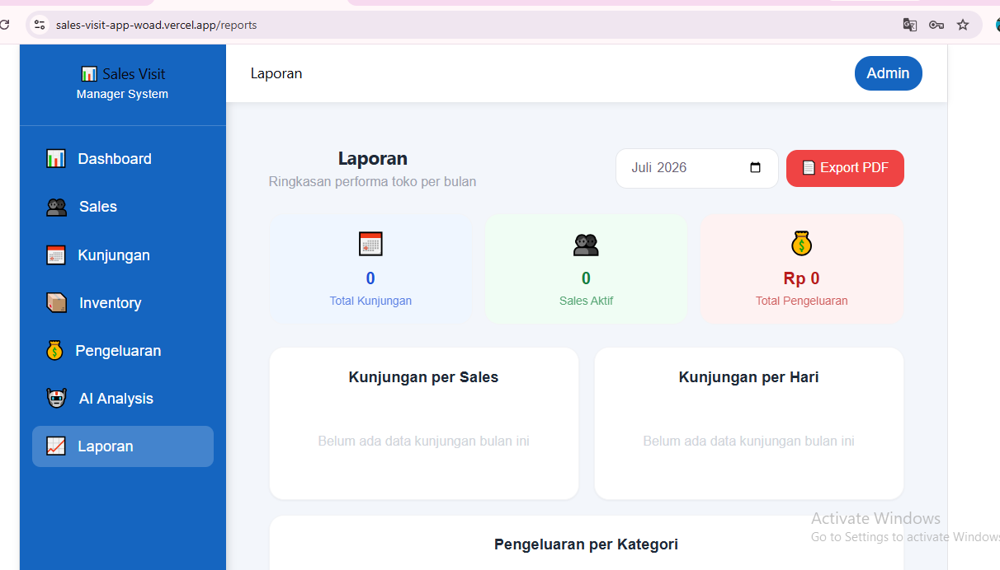

<div align="center">

# 🚀 Sales Visit App
### Sistem Manajemen Kunjungan Sales Berbasis Web

**Aplikasi berbasis web untuk membantu pengelolaan aktivitas kunjungan sales, data sales, inventaris, pengeluaran, laporan, dan analisis AI dalam satu dashboard yang modern, cepat, dan mudah digunakan.**

[](https://sales-visit-app-woad.vercel.app/login)
[](https://react.dev)
[](https://vitejs.dev)
[](https://firebase.google.com)
[](https://vercel.com)

🌐 **Live Demo**

https://sales-visit-app-woad.vercel.app/login

📂 **GitHub Repository**

https://github.com/vickyagstn/myProject/tree/main/sales-visit-app

🔥 **Firebase Console**

https://console.firebase.google.com/project/sales-visit-manager/overview

</div>

---

# 📌 Tentang Sales Visit App

**Sales Visit App** merupakan aplikasi manajemen kunjungan sales berbasis web yang dirancang untuk membantu administrator dalam mengelola aktivitas sales secara digital. Seluruh data kunjungan, inventaris, pengeluaran operasional, hingga laporan penjualan dapat dikelola dalam satu dashboard yang terintegrasi.

Selain itu, aplikasi ini juga dilengkapi dengan fitur **AI Analysis** yang membantu memberikan analisis terhadap data yang telah tersimpan sehingga proses monitoring menjadi lebih efektif dan efisien.

> Dengan Sales Visit App, seluruh aktivitas sales dapat terdokumentasi secara digital sehingga proses monitoring, evaluasi, dan pelaporan menjadi lebih cepat, akurat, dan transparan.

---

# ✨ Fitur Utama

## 👨‍💼 Admin

- 🔐 Login Admin
- 📊 Dashboard
- 👥 Manajemen Data Sales
- 📍 Manajemen Kunjungan Sales
- 📦 Manajemen Inventory
- 💰 Manajemen Pengeluaran
- 🤖 AI Analysis
- 📈 Laporan
- 📄 Export PDF
- 📊 Statistik Bulanan
- 🔍 Pencarian Data
- ⚙️ Pengaturan Sistem

---

# 🖥️ Screenshot

| Login | Dashboard |
|--------|-----------|
|  |  |

| Sales | Kunjungan |
|--------|------------|
|  |  |

| Inventory | Pengeluaran |
|------------|-------------|
|  |  |

| AI Analysis | Laporan |
|-------------|----------|
|  |  |

---

# 🛠️ Tech Stack

| Teknologi | Kegunaan |
|------------|-------------------------|
| React 19 | Frontend Framework |
| Vite | Build Tool |
| Firebase Authentication | Authentication |
| Firebase Firestore | Database |
| Firebase Storage | Penyimpanan File |
| React Router DOM | Routing |
| Tailwind CSS | UI Styling |
| Chart.js / Recharts | Grafik Laporan |
| jsPDF | Export PDF |
| XLSX | Export Excel |
| OpenRouter AI | AI Analysis |
| Vercel | Hosting |

---

# 🔐 Akses Demo

Gunakan akun berikut untuk mencoba aplikasi.

| Role | Email | Password |
|------|-------|----------|
| 👨‍💼 **Admin** | `admin@toko.com` | `admin123` |

> Login menggunakan akun admin untuk mengakses seluruh fitur aplikasi.

---

# 🚀 Cara Menjalankan Project

## 1. Clone Repository

```bash
git clone https://github.com/vickyagstn/myProject.git
```

---

## 2. Masuk ke Folder Project

```bash
cd myProject/sales-visit-app
```

---

## 3. Install Dependency

```bash
npm install
```

---

## 4. Buat File Environment

Buat file `.env`

```env
VITE_FIREBASE_API_KEY=YOUR_FIREBASE_API_KEY
VITE_FIREBASE_AUTH_DOMAIN=YOUR_FIREBASE_AUTH_DOMAIN
VITE_FIREBASE_PROJECT_ID=YOUR_FIREBASE_PROJECT_ID
VITE_FIREBASE_STORAGE_BUCKET=YOUR_FIREBASE_STORAGE_BUCKET
VITE_FIREBASE_MESSAGING_SENDER_ID=YOUR_FIREBASE_MESSAGING_SENDER_ID
VITE_FIREBASE_APP_ID=YOUR_FIREBASE_APP_ID

VITE_OPENROUTER_API_KEY=YOUR_OPENROUTER_API_KEY
```

---

## 5. Jalankan Project

```bash
npm run dev
```

Project akan berjalan di

```
http://localhost:5173
```

---

# 📁 Struktur Project

```text
sales-visit-app
│
├── images
│   ├── login.png
│   ├── dashboard.png
│   ├── sales.png
│   ├── kunjungan.png
│   ├── inventory.png
│   ├── pengeluaran.png
│   ├── ai-analysis.png
│   └── laporan.png
│
├── public
├── src
│   ├── assets
│   ├── components
│   ├── contexts
│   ├── hooks
│   ├── layouts
│   ├── pages
│   ├── routes
│   ├── services
│   ├── utils
│   ├── App.jsx
│   └── main.jsx
│
├── package.json
├── vite.config.js
└── README.md
```

---

# 👥 Hak Akses

| Fitur | Admin |
|-------|:-----:|
| Dashboard | ✅ |
| Data Sales | ✅ |
| Kunjungan | ✅ |
| Inventory | ✅ |
| Pengeluaran | ✅ |
| AI Analysis | ✅ |
| Laporan | ✅ |
| Export PDF | ✅ |
| Pengaturan | ✅ |

> ✅ = Dapat Mengelola

---

# 🗺️ Roadmap

- ✅ Login Authentication
- ✅ Dashboard
- ✅ Data Sales
- ✅ Kunjungan Sales
- ✅ Inventory
- ✅ Pengeluaran
- ✅ AI Analysis
- ✅ Laporan
- ✅ Export PDF
- 🔄 Export Excel
- 🔄 Dashboard Analytics
- 🔄 Dark Mode
- 🔄 Backup Database

---

# ☁️ Deployment

| Platform | Link |
|----------|------|
| 🌐 Vercel | https://sales-visit-app-woad.vercel.app/login |
| 🔥 Firebase | https://console.firebase.google.com/project/sales-visit-manager/overview |
| 💻 GitHub | https://github.com/vickyagstn/myProject/tree/main/sales-visit-app |

---

# 👨‍💻 Author

**Vicky Agustine**

GitHub: https://github.com/vickyagstn

---

<div align="center">

### ⭐ Jika repository ini bermanfaat, jangan lupa berikan Star ⭐

**Made with ❤️ using React, Firebase, Vite & OpenRouter AI**

</div>
