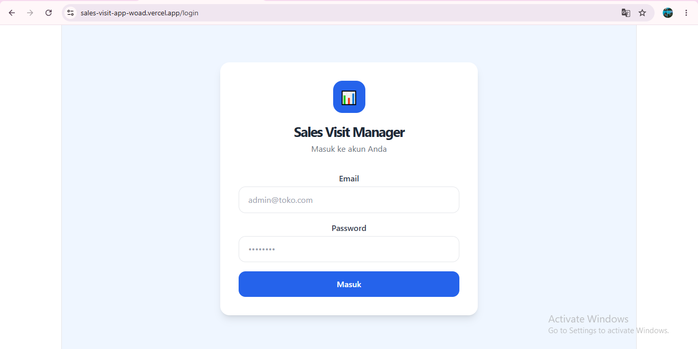
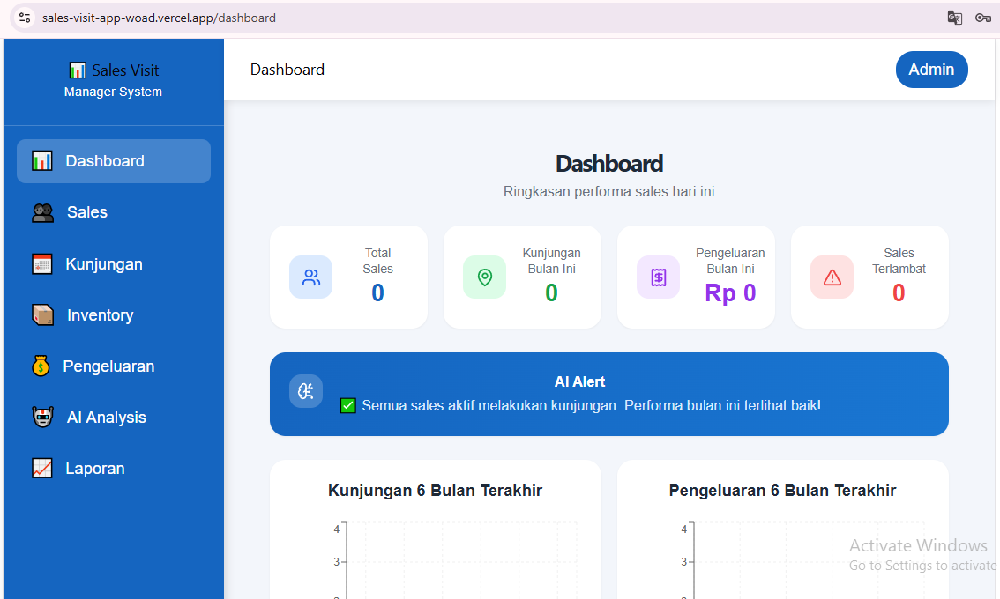
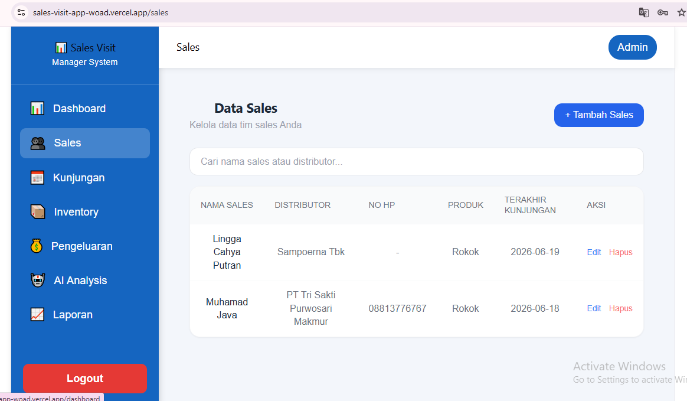
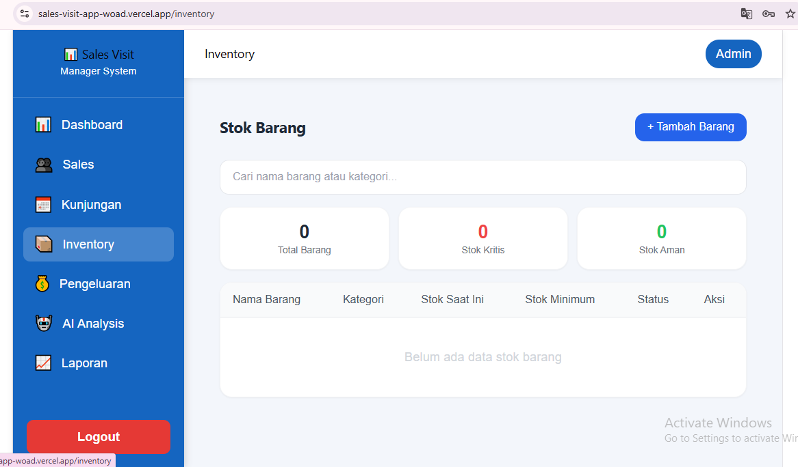
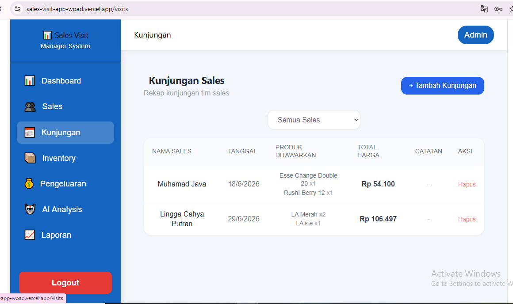
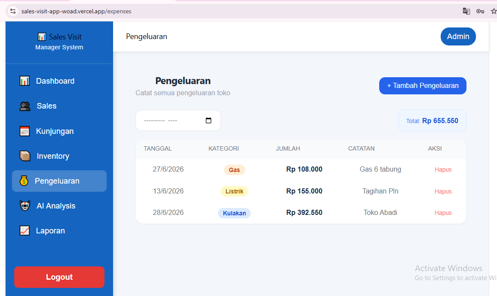
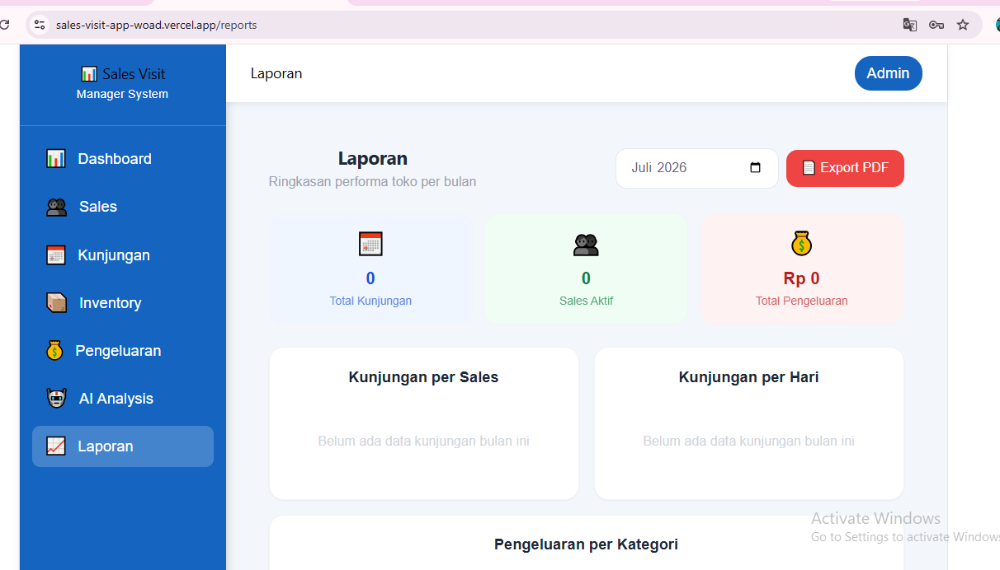
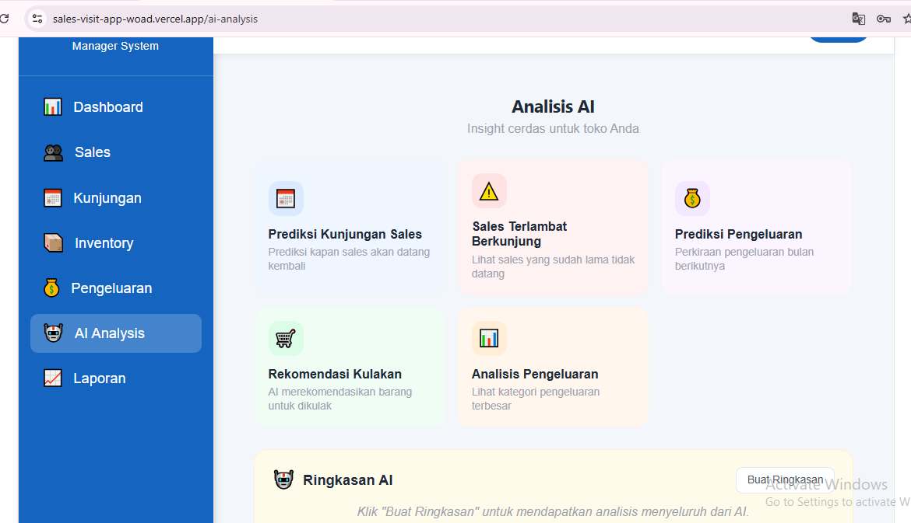

<div align="center">

# 🚚 Sales Visit Manager

### Sistem Monitoring Kunjungan Sales Berbasis Web

Aplikasi **Sales Visit Manager** merupakan sistem informasi yang membantu pemilik toko dalam mencatat kunjungan sales, mengelola data produk yang ditawarkan, memantau pengeluaran, serta menyimpan riwayat kunjungan secara digital.

[](https://sales-visit-app-woad.vercel.app/)


</div>

---

# 📖 Tentang Project

**Sales Visit Manager** adalah aplikasi berbasis web yang dirancang untuk membantu pemilik toko dalam mengelola aktivitas kunjungan sales secara digital.

Aplikasi ini memudahkan pencatatan data sales, produk yang ditawarkan, riwayat kunjungan, serta pengeluaran toko. Selain itu tersedia dashboard untuk memonitor aktivitas sales sehingga seluruh data tersimpan secara terstruktur dan mudah diakses.

Project dikembangkan menggunakan **React**, **Vite**, **Tailwind CSS**, dan **Firebase** sebagai backend.

---

# 🎯 Permasalahan yang Diselesaikan

Aplikasi ini dikembangkan untuk membantu mengatasi beberapa permasalahan berikut.

- Sales datang ke toko tidak menentu.
- Sulit mengetahui kapan sales terakhir berkunjung.
- Sulit mengetahui produk yang pernah ditawarkan.
- Pengeluaran toko masih dicatat secara manual.
- Riwayat kunjungan sales tidak terdokumentasi dengan baik.

---

# ✨ Fitur Utama

- 🔐 Login Admin
- 📊 Dashboard Monitoring
- 👨‍💼 Manajemen Data Sales
- 📦 Manajemen Produk / Inventory
- 🚚 Pencatatan Kunjungan Sales
- 💰 Manajemen Pengeluaran
- 📈 Laporan Kunjungan
- 🤖 AI Analysis Dashboard
- 🔍 Riwayat Aktivitas Sales
- 📱 Responsive Design

---

# 🌐 Live Demo

## 🔗 Demo Aplikasi

https://sales-visit-app-woad.vercel.app/

---

# 👤 Hak Akses

| Role | Email | Password |
|------|-------|----------|
| 👨‍💼 Admin | `admin@toko.com` | `admin123` |

---

# 📸 Screenshot

| Login | Dashboard |
|--------|-----------|
|  |  |

<br>

| Data Sales | Inventory |
|-------------|-----------|
|  |  |

<br>

| Kunjungan | Pengeluaran |
|------------|-------------|
|  |  |

<br>

| Laporan | AI Analysis |
|----------|-------------|
|  |  |

---

# 🛠️ Tech Stack

| Teknologi | Digunakan Untuk |
|-----------|-----------------|
| React JS | Frontend |
| Vite | Build Tool |
| Tailwind CSS | Styling |
| Firebase Authentication | Login |
| Cloud Firestore | Database |
| Firebase Storage | Penyimpanan File |
| JavaScript | Programming Language |

---

# 🚀 Cara Menjalankan

## 1. Clone Repository

```bash
git clone https://github.com/vickyagstn/myProject.git

cd myProject/sales-visit-app
```

---

## 2. Install Dependency

```bash
npm install
```

---

## 3. Jalankan Project

```bash
npm run dev
```

Aplikasi akan berjalan di:

```
http://localhost:5173
```

---

# 🔥 Firebase

Project menggunakan **Firebase** sebagai backend.

Firebase digunakan untuk:

- Firebase Authentication
- Cloud Firestore
- Firebase Storage

### Firebase Console

https://console.firebase.google.com/project/sales-visit-manager/overview

---

# 📂 Data yang Dikelola

- 👨‍💼 Data Sales
- 🏪 Data Toko
- 📦 Inventory Produk
- 🚚 Riwayat Kunjungan
- 💰 Pengeluaran
- 📊 Laporan
- 🤖 Analisis AI

---

# 👥 Hak Akses

## 👨‍💼 Admin

Admin memiliki akses penuh terhadap seluruh sistem.

Menu yang tersedia:

- Dashboard
- Data Sales
- Inventory
- Kunjungan Sales
- Pengeluaran
- Laporan
- AI Analysis

---

# 📱 Alur Penggunaan

```text
Login
   │
   ▼
Dashboard
   │
   ▼
Input Data Sales
   │
   ▼
Input Inventory
   │
   ▼
Catat Kunjungan
   │
   ▼
Input Pengeluaran
   │
   ▼
Laporan
   │
   ▼
AI Analysis
```

---

# 📁 Struktur Project

```text
sales-visit-app/
│
├── images/
│   ├── login.png
│   ├── dashboard.png
│   ├── sales.png
│   ├── inventory.png
│   ├── kunjungan.png
│   ├── pengeluaran.png
│   ├── laporan.png
│   └── ai-analysis.png
│
├── src/
├── public/
├── package.json
├── vite.config.js
└── README.md
```

---

# 🚀 Deployment

| Platform | Link |
|----------|------|
| 🌐 Live Demo | https://sales-visit-app-woad.vercel.app/ |
| 🔥 Firebase | https://console.firebase.google.com/project/sales-visit-manager/overview |
| 💻 GitHub Repository | https://github.com/vickyagstn/myProject/tree/main/sales-visit-app |

---

# 🎯 Manfaat Aplikasi

Dengan menggunakan **Sales Visit Manager**, pemilik toko dapat:

- Mengetahui jadwal kunjungan sales.
- Menyimpan riwayat produk yang ditawarkan.
- Mengelola inventory dengan lebih mudah.
- Mencatat pengeluaran toko.
- Memantau aktivitas sales melalui dashboard.
- Membantu pengambilan keputusan berdasarkan data yang tersimpan.

---

# 🗺️ Roadmap

- ✅ Login Admin
- ✅ Dashboard
- ✅ Data Sales
- ✅ Inventory
- ✅ Kunjungan Sales
- ✅ Pengeluaran
- ✅ Laporan
- ✅ Firebase Integration
- ✅ AI Analysis
- ✅ Responsive Design
- ⬜ Export PDF
- ⬜ Export Excel
- ⬜ Grafik Statistik

---

# 👨‍💻 Developer

**Vicky Agustine**

Mahasiswa Teknologi Rekayasa Perangkat Lunak

**GitHub**

https://github.com/vickyagstn

---

<div align="center">

### ⭐ Jangan lupa berikan Star apabila project ini bermanfaat.

Made with ❤️ by **Vicky Agustine**

</div>
